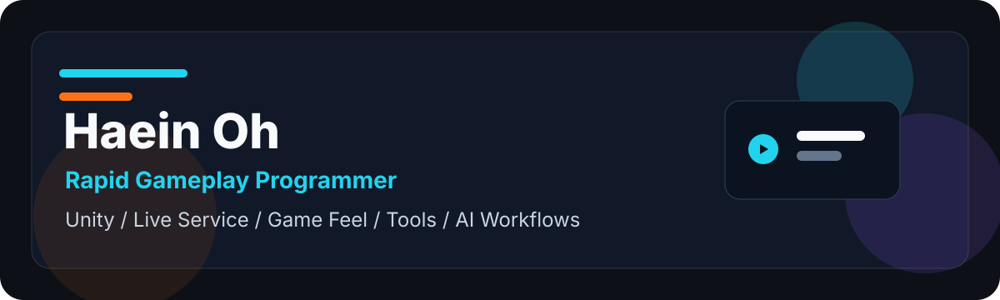
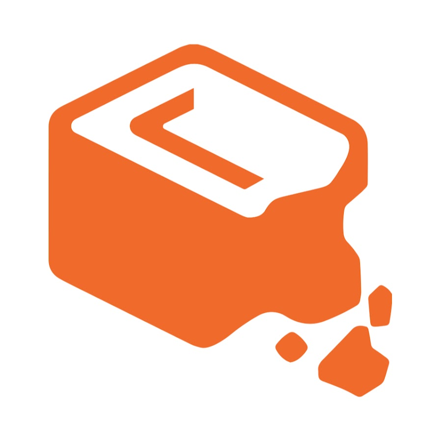
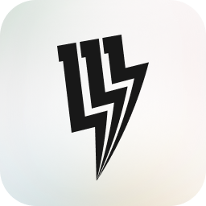
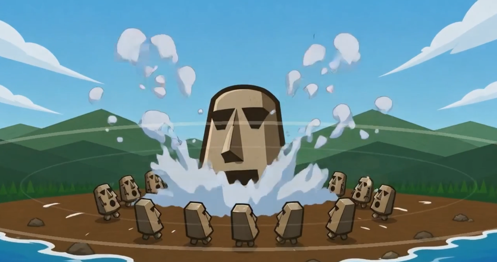
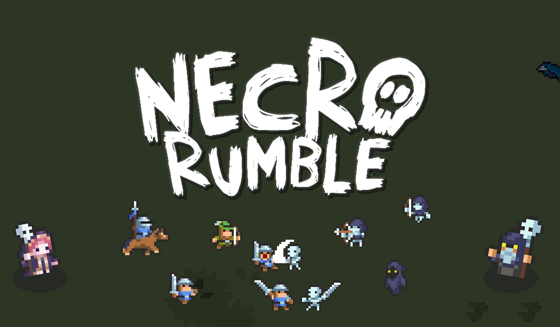
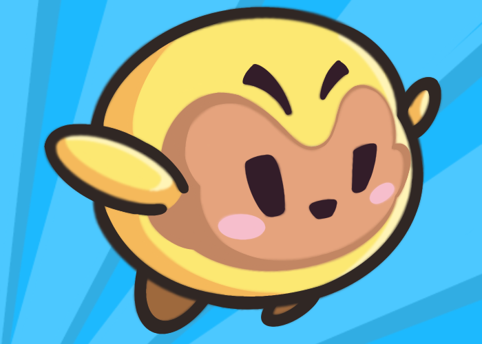

<table>
  <tr>
    <td width="74%">
      
    </td>
    <td width="26%" align="center">
      
       
      <h2>Haein Oh</h2>
      <b>Gameplay Programmer</b>
       
      Fast prototypes · Game feel · Live service
    </td>
  </tr>
</table>

I build fast prototypes, responsive game feel, and production-ready gameplay systems for mobile and live-service games.

<table>
  <tr>
    <td align="center"></td>
    <td align="center"></td>
    <td align="center"></td>
    <td align="center"></td>
  </tr>
</table>

---

## What I Build

<table>
  <tr>
    <td align="center" width="33%">
      
      <h3>Gameplay</h3>
      Combat feel, controls, mobile UX, fast Unity prototyping.
    </td>
    <td align="center" width="33%">
      
      <h3>Live Service</h3>
      Crashlytics, QA loops, SDK maintenance, launch support.
    </td>
    <td align="center" width="33%">
      
      <h3>Tools & AI</h3>
      Internal tools, automation, AI-assisted production workflows.
    </td>
  </tr>
</table>

## Stack

<table>
  <tr>
    <td align="center" width="16%"> <b>Unity</b></td>
    <td align="center" width="16%"> <b>C#</b></td>
    <td align="center" width="16%"> <b>Lua</b></td>
    <td align="center" width="16%"> <b>LÖVE</b></td>
    <td align="center" width="16%"> <b>GameMaker</b></td>
    <td align="center" width="16%"> <b>JavaScript</b></td>
  </tr>
  <tr>
    <td align="center"> <b>React</b></td>
    <td align="center"> <b>Firebase</b></td>
    <td align="center"> <b>Supabase</b></td>
    <td align="center"> <b>Jenkins</b></td>
    <td align="center"> <b>Git</b></td>
    <td align="center"> <b>Perforce</b></td>
  </tr>
</table>

## Experience

<table>
  <tr>
    <td width="50%">
      

      <h3 align="center">Halfbrick Studios</h3>
      
<b>Gameplay Programmer</b>

      <ul>
        <li>Jetpack Joyride Racing feature development, soft launch, and global launch support.</li>
        <li>Halfbrick+ HubApp ecosystem feature work.</li>
        <li>QA, dogfooding, Crashlytics analysis, bug fixing, and SDK maintenance.</li>
      </ul>
    </td>
    <td width="50%">
      

      <h3 align="center">111%</h3>
      
<b>Game Client Programmer</b>

      <ul>
        <li>Designed and implemented 70+ achievement systems.</li>
        <li>Combat, boss, skin, augment, event, and live-service systems.</li>
        <li>Unity, Firebase, Jenkins, Git, Redmine, and production QA workflows.</li>
      </ul>
    </td>
  </tr>
</table>

## Featured Work

<table>
  <tr>
    <td width="240">
      
    </td>
    <td>
      <h3>Moai Wanna Slam</h3>
      
Solo Lua/LÖVE action project focused on responsive combat and fast iteration.

      

        
        
        
      

      <ul>
        <li>Improved multiplayer lag issues on Android builds.</li>
        <li>Resolved shader rendering differences across iOS, APK, and PC builds.</li>
        <li>Built a DDQN-based AI bot for match testing.</li>
      </ul>
      <a href="https://youtu.be/NQWIjDBJFcg?si=7qa5_IgFxliFEN-9">Video</a>
    </td>
  </tr>
  <tr>
    <td width="240">
      
    </td>
    <td>
      <h3>Necro Rumble</h3>
      
Steam strategy roguelike developed through Krafton Jungle Game Lab.

      

        
        
        
      

      <ul>
        <li>Contributed unit design, gameplay systems, and skill implementation.</li>
        <li>Released on Steam and reached 40,000+ copies distributed.</li>
      </ul>
      <a href="https://store.steampowered.com/app/2735950/Necro_Rumble/">Steam</a> / <a href="https://github.com/badarang/NecroRumble">GitHub</a>
    </td>
  </tr>
  <tr>
    <td width="240">
      
    </td>
    <td>
      <h3>Animal Jumping!</h3>
      
Solo Unity mobile project built around one-touch timing, mobile optimization, ads/IAP, and real-time 1v1 play.

      

        
        
        
      

      <ul>
        <li>Implemented procedural map flow, optimization work, AdMob/IAP, and BACKND Match integration.</li>
        <li>Google Play listing is no longer active, so current references point to the sample repo and press coverage.</li>
      </ul>
      <a href="https://github.com/badarang/AnimalJumping_Sample">GitHub Sample</a> / <a href="https://www.pinpointnews.co.kr/news/articleView.html?idxno=305741">Press</a>
    </td>
  </tr>
</table>

## Project Archive

## Current Direction

Fast gameplay prototyping, mobile live-service reliability, internal tool development, and AI-assisted production workflows.
