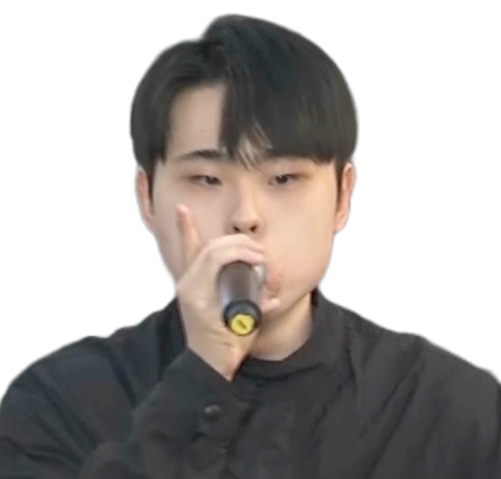

  

  <h1>Haein Oh</h1>
  <h3>Rapid Gameplay Programmer</h3>

  

    I build fast prototypes, responsive game feel, and production-ready gameplay systems for mobile and live-service games.
  

  

    
    
    
    
  

---

## Now

<table>
  <tr>
    <td width="33%"><b>Gameplay</b> Combat feel, mobile UX, fast prototyping, Unity feature work.</td>
    <td width="33%"><b>Live Service</b> Crashlytics, QA loops, SDK maintenance, launch support.</td>
    <td width="33%"><b>Tools & AI</b> Internal tools, automation, and AI-assisted production workflows.</td>
  </tr>
</table>

## GitHub Snapshot

  <picture>
    <source media="(prefers-color-scheme: dark)" srcset="https://github-readme-stats.vercel.app/api?username=badarang&show_icons=true&rank_icon=github&hide_border=true&theme=github_dark&include_all_commits=true" />
    <source media="(prefers-color-scheme: light)" srcset="https://github-readme-stats.vercel.app/api?username=badarang&show_icons=true&rank_icon=github&hide_border=true&theme=default&include_all_commits=true" />
    
  </picture>
  <picture>
    <source media="(prefers-color-scheme: dark)" srcset="https://github-readme-stats.vercel.app/api/top-langs/?username=badarang&layout=compact&hide_border=true&theme=github_dark&langs_count=8" />
    <source media="(prefers-color-scheme: light)" srcset="https://github-readme-stats.vercel.app/api/top-langs/?username=badarang&layout=compact&hide_border=true&theme=default&langs_count=8" />
    
  </picture>

## Stack

  
  
  
  
  
  
  
  
  
  
  
  

## Experience

<table>
  <tr>
    <td width="50%">
      <h3>Halfbrick Studios</h3>
      <b>Gameplay Programmer</b>
        
      <ul>
        <li>Contributed to Jetpack Joyride Racing feature development, soft launch, and global launch work.</li>
        <li>Worked across the Halfbrick+ HubApp ecosystem.</li>
        <li>Supported live mobile stability through QA, dogfooding, Crashlytics analysis, bug fixing, and SDK maintenance.</li>
      </ul>
    </td>
    <td width="50%">
      <h3>111%</h3>
      <b>Game Client Programmer</b>
        
      <ul>
        <li>Designed and implemented 70+ achievement systems.</li>
        <li>Developed combat, boss, skin, augment, event, and live-service systems.</li>
        <li>Worked with Unity, Firebase, Jenkins, Git, Redmine, and production QA workflows.</li>
      </ul>
    </td>
  </tr>
</table>

## Featured Work

  <a href="https://github.com/badarang/NecroRumble">
    <picture>
      <source media="(prefers-color-scheme: dark)" srcset="https://github-readme-stats.vercel.app/api/pin/?username=badarang&repo=NecroRumble&hide_border=true&theme=github_dark" />
      <source media="(prefers-color-scheme: light)" srcset="https://github-readme-stats.vercel.app/api/pin/?username=badarang&repo=NecroRumble&hide_border=true&theme=default" />
      
    </picture>
  </a>
  <a href="https://github.com/badarang/AnimalJumping_Sample">
    <picture>
      <source media="(prefers-color-scheme: dark)" srcset="https://github-readme-stats.vercel.app/api/pin/?username=badarang&repo=AnimalJumping_Sample&hide_border=true&theme=github_dark" />
      <source media="(prefers-color-scheme: light)" srcset="https://github-readme-stats.vercel.app/api/pin/?username=badarang&repo=AnimalJumping_Sample&hide_border=true&theme=default" />
      
    </picture>
  </a>

<table>
  <tr>
    <td width="220">
      
    </td>
    <td>
      <h3>Necro Rumble</h3>
      
Steam strategy roguelike developed through Krafton Jungle Game Lab.

      <ul>
        <li>Contributed unit design, gameplay systems, and skill implementation.</li>
        <li>Released on Steam and reached 40,000+ copies distributed.</li>
      </ul>
      <a href="https://store.steampowered.com/app/2735950/Necro_Rumble/">Steam</a> ·
      <a href="https://github.com/badarang/NecroRumble">GitHub</a>
    </td>
  </tr>
  <tr>
    <td width="220">
      
    </td>
    <td>
      <h3>Animal Jumping!</h3>
      
Solo Unity mobile project built around one-touch timing, mobile optimization, ads/IAP, and real-time 1v1 play.

      <ul>
        <li>Implemented procedural map flow, optimization work, AdMob/IAP, and BACKND Match integration.</li>
        <li>Google Play listing is no longer active, so current references point to the sample repo and press coverage.</li>
      </ul>
      <a href="https://github.com/badarang/AnimalJumping_Sample">GitHub Sample</a> ·
      <a href="https://www.pinpointnews.co.kr/news/articleView.html?idxno=305741">Press</a>
    </td>
  </tr>
</table>

  
<b>More projects and prototypes</b>

   

  - Moai Wanna Slam: solo Lua/LÖVE action project focused on responsive game feel.
  - Collecting Ninja, Monster Rush Tactics, Among the Stars, Dash and Friends, BBuZit, and more prototypes on itch.io.
  - Portfolio archive: https://haeinoh.vercel.app

## Current Direction

I am sharpening my portfolio around fast gameplay prototyping, mobile live-service reliability, internal tool development, and AI-assisted production workflows.
