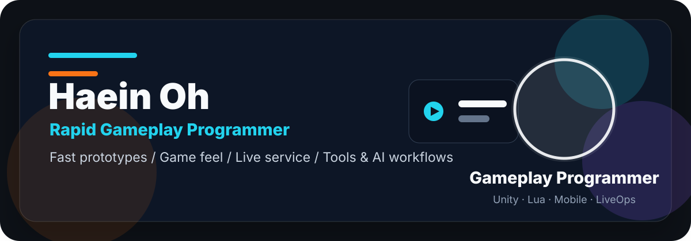
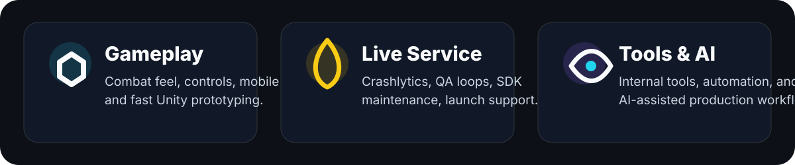
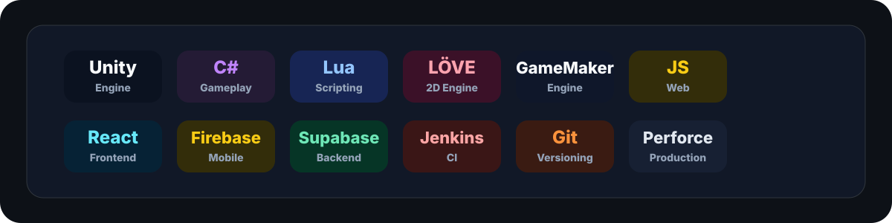
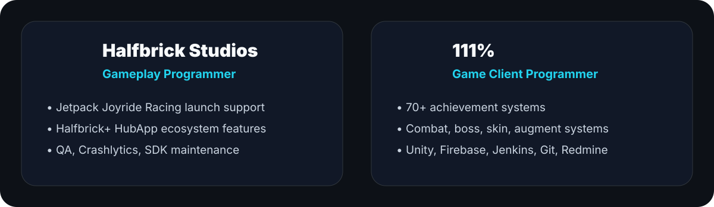

  

I build fast prototypes, responsive game feel, and production-ready gameplay systems for mobile and live-service games.

  <a href="https://haeinoh.vercel.app">Portfolio</a> ·
  <a href="https://www.linkedin.com/in/haein-oh-979b29304/">LinkedIn</a> ·
  <a href="mailto:badarangdev@gmail.com">Email</a> ·
  <a href="https://badarang.itch.io">itch.io</a>

---

## What I Build

  

## Stack

  

## Experience

  

## Featured Work

<table>
  <tr>
    <td width="240">
      
    </td>
    <td>
      <h3>Moai Wanna Slam</h3>
      
Solo Lua/LÖVE action project focused on responsive combat and fast iteration.

      

        
        
        
      

      <ul>
        <li>Improved multiplayer lag issues on Android builds.</li>
        <li>Resolved shader rendering differences across iOS, APK, and PC builds.</li>
        <li>Built a DDQN-based AI bot for match testing.</li>
      </ul>
      <a href="https://youtu.be/NQWIjDBJFcg?si=7qa5_IgFxliFEN-9">Video</a>
    </td>
  </tr>
  <tr>
    <td width="240">
      
    </td>
    <td>
      <h3>Necro Rumble</h3>
      
Steam strategy roguelike developed through Krafton Jungle Game Lab.

      

        
        
        
      

      <ul>
        <li>Contributed unit design, gameplay systems, and skill implementation.</li>
        <li>Released on Steam and reached 40,000+ copies distributed.</li>
      </ul>
      <a href="https://store.steampowered.com/app/2735950/Necro_Rumble/">Steam</a> / <a href="https://github.com/badarang/NecroRumble">GitHub</a>
    </td>
  </tr>
  <tr>
    <td width="240">
      
    </td>
    <td>
      <h3>Animal Jumping!</h3>
      
Solo Unity mobile project built around one-touch timing, mobile optimization, ads/IAP, and real-time 1v1 play.

      

        
        
        
      

      <ul>
        <li>Implemented procedural map flow, optimization work, AdMob/IAP, and BACKND Match integration.</li>
        <li>Google Play listing is no longer active, so current references point to the sample repo and press coverage.</li>
      </ul>
      <a href="https://github.com/badarang/AnimalJumping_Sample">GitHub Sample</a> / <a href="https://www.pinpointnews.co.kr/news/articleView.html?idxno=305741">Press</a>
    </td>
  </tr>
</table>

## Project Archive

## Current Direction

Fast gameplay prototyping, mobile live-service reliability, internal tool development, and AI-assisted production workflows.
